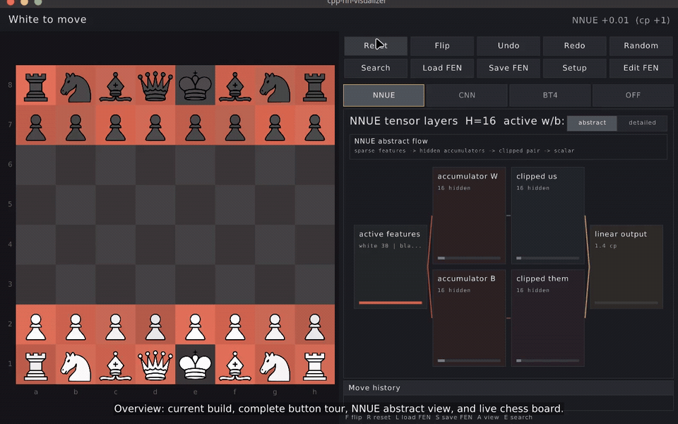

# cpp-nn-visualizer

Native C++ raylib visualizer for chess neural-network activations across
three architectures: NNUE (half-KP), LC0 CNN ResNet, and LC0 BT4
transformer. Built as the final project for a C++ programming course; the
same binary doubles as the Tutorial III deliverable (a complete
human-vs-human chess game).

All chess logic and NN inference run in this repo's C++ code — no
subprocesses to external engines or toolkits at runtime. Weight files are
plain binary blobs loaded by `src/io/WeightFileReader`.

## Team

| Name | Student number |
| --- | --- |
| Lennart Axel Conrad | 2025080264 |
| Erik Mkrtchyan | 2025080273 |

Course requirements are archived in [Project2026.pdf](Project2026.pdf).

Related prior chess work:

- [LenniAConrad/chess-rtk](https://github.com/LenniAConrad/chess-rtk): Java chess research toolkit used as prior reference material for chess-domain design and selected algorithm translation.
- [LenniAConrad/chess-web](https://github.com/LenniAConrad/chess-web): separate TypeScript web chess player/trainer used as interface and gameplay background reference.

## Tutorial Demo



The animated walkthrough is a 12 FPS fullscreen live capture from the current
app build. It starts with the activation panel OFF, then selects NNUE, CNN,
and BT4 and shows both abstract and detailed views for each architecture. It
also covers Reset, Flip, Undo/Redo, Random, Search, Load FEN, Save FEN, Setup,
Edit FEN, editor sub-controls, and the native engine-style search preview with
live depth, nodes, evaluation, and PV. The full-resolution MP4 version is
[docs/demo.mp4](docs/demo.mp4).

## Build

Requirements: a C++17 compiler, CMake ≥ 3.20, and the system libraries
raylib needs (X11 / OpenGL on Linux). CUDA is optional; when `nvcc` is
available the build includes GPU tensor kernels for larger `matmul` and
`conv2d` calls, and the runtime falls back to CPU if no usable CUDA
device/driver is present. Disable it with `-DCNNV_ENABLE_CUDA=OFF`.
On Debian/Ubuntu:

```bash
sudo apt install build-essential cmake libgl1-mesa-dev libx11-dev \
    libxrandr-dev libxinerama-dev libxcursor-dev libxi-dev
```

Then:

```bash
./scripts/build.sh
```

Or manually:

```bash
cmake -B build
cmake --build build -j
./build/cnnv
```

## Model Files

Populate ignored local model files with:

```bash
./scripts/import_models.sh
```

The importer prefers `~/Code/chess-models/models` and
`~/Code/chess-rtk/models`, then falls back to known download URLs where
available. Runtime model paths use a consistent `.bin` naming scheme:
`nnue-halfkp-demo.bin`, `lc0-cnn-112p-10x128-policy4672-wdl3.bin`, and
`lc0-bt4-1024x15x32h-visual.bin`. Optional upstream reference blobs are also
stored with `-reference.bin` names when imported.

## Test

```bash
./scripts/test.sh
```

## API Documentation

Source headers use Doxygen/Javadoc-style comments (`/** ... */`) for public
classes, functions, and important data structures. If Doxygen is installed,
generate browsable HTML API docs with:

```bash
cmake --build build --target docs
```

or directly:

```bash
doxygen Doxyfile
```

Generated output is written under `build/docs/doxygen/html`.

## Layout

```
src/chess/      legal-move chess core (transpiled subset of chess-rtk)
src/game/       game state, move history (linked list), PGN export
src/nn/         architecture-agnostic Tensor, ops, INetwork base
src/nn/nnue/    NNUE half-KP forward pass
src/nn/lc0_cnn/ Leela CNN ResNet forward pass
src/nn/lc0_bt4/ Leela BT4 transformer forward pass
src/viz/        raylib UI: boards, controls, activation views, editor
src/io/         FEN, PGN, config, weight file loaders
tests/          unit tests, perft, NN numerical-match tests
docs/           design spec, user manual, test cases, summary, AI usage
models/         weight files (not committed; see models/README.md)
assets/         piece sprites, fonts
```

## Documents

- [docs/project-proposal-requirements.md](docs/project-proposal-requirements.md)
- [docs/design-spec.md](docs/design-spec.md)
- [docs/user-manual.md](docs/user-manual.md)
- [docs/test-cases.md](docs/test-cases.md)
- [docs/summary-report.md](docs/summary-report.md)
- [docs/ai-usage.md](docs/ai-usage.md)
- [docs/tutorial.gif](docs/tutorial.gif)
- [docs/demo.mp4](docs/demo.mp4)

PDF exports can be regenerated with:

```bash
./scripts/export_docs.sh
```

The execution plan lives in [TODO.md](TODO.md).
