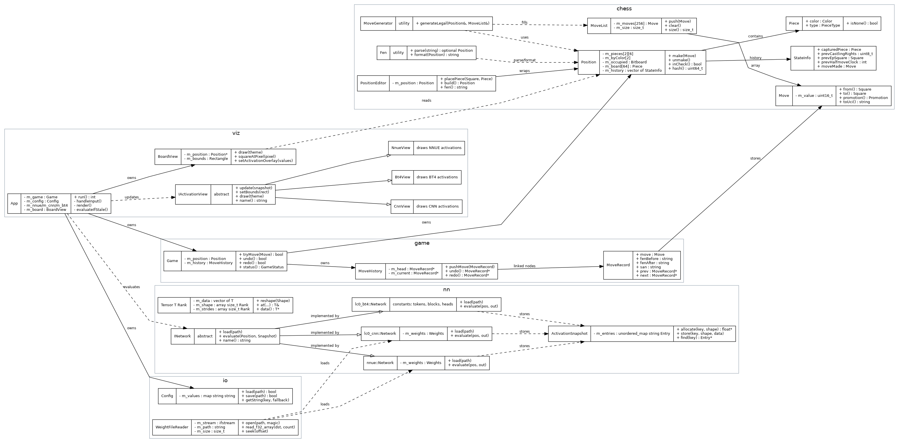
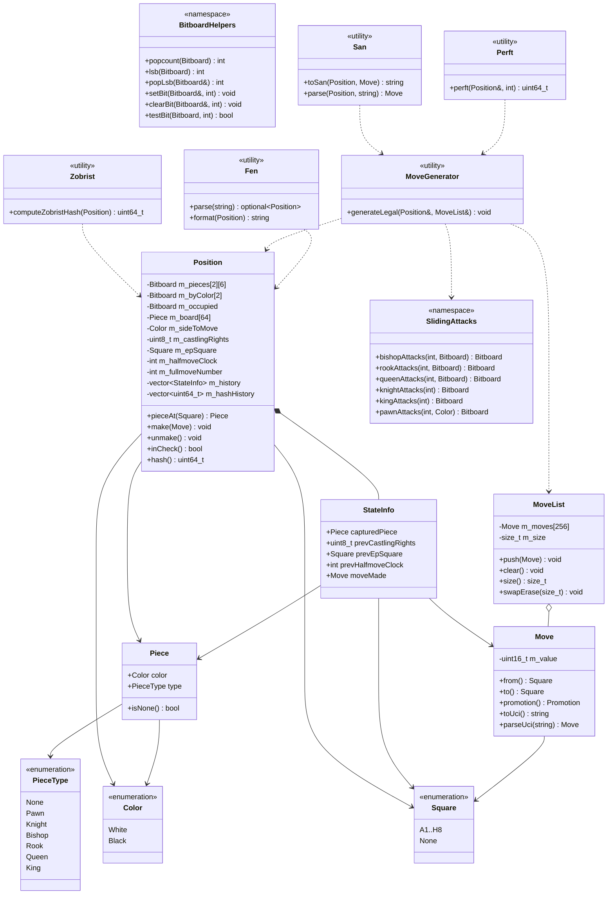

# Design Specification

## 1. Project overview

`cpp-nn-visualizer` is a native C++17 raylib application for playing a legal
human-vs-human chess game and inspecting neural-network activations for the
current position. The chess core is independent of raylib and NN code so it can
be unit-tested with perft, FEN, SAN, and game-loop tests.

## 2. High-level architecture

The executable links two static libraries:

- `cnnv_core`: chess rules, game state, file I/O, tensor ops, and network
  inference.
- `cnnv_viz`: raylib views and input handling. This layer owns no chess rules;
  it requests legal moves through `game::Game` and `chess::MoveGenerator`.

## 3. Module responsibilities

### 3.1 chess — legal-move core

The `chess` module owns board representation, FEN/SAN notation, move
generation, make/unmake, draw/checkmate helpers, and Zobrist hashing. It is
designed around bitboards for fast set operations plus a 64-square mailbox for
simple UI and parser lookups.

### 3.2 game — game state and history

The `game` module owns the current `Position`, legal move application, status
calculation, and the manually implemented linked-list move history. All
mutation paths go through `game::Game` so the board, FEN snapshots, SAN text,
undo, redo, and UI move list stay consistent.

### 3.3 nn — architecture-agnostic NN building blocks

The `nn` module contains shared tensor and activation infrastructure:
`Tensor<T, Rank>`, `ActivationSnapshot`, `INetwork`, and low-level operations
such as matrix multiplication, convolution, batch normalization, layer
normalization, activation functions, and attention. CUDA kernels are optional;
the CPU path remains the required runtime path.

### 3.4 nn/nnue — NNUE half-KP

The NNUE module implements feature encoding, accumulator refresh, model loading,
and a forward pass that exposes accumulator values, clipped activations, active
features, output weights, piece contributions, and a centipawn score.

### 3.5 nn/lc0_cnn — Leela CNN ResNet

The CNN module encodes the board into 112 input planes, runs a float32 LC0-style
residual trunk, policy head, and WDL/value head, then stores intermediate
feature maps in the shared activation snapshot for visualization.

### 3.6 nn/lc0_bt4 — Leela BT4 transformer

The BT4 module exposes a native C++ token-transformer visualization path. It
uses the same board-plane encoder, projects the position to 64 square tokens,
runs deterministic attention/FFN blocks, and produces policy/value summaries.
This is not a protobuf-compatible LC0 BT4 weight loader; it validates the
project's BT4 `.bin` metadata file and uses a C++ model path designed for
explainable visualization.

### 3.7 viz — raylib UI

The `viz` module owns all raylib drawing and input handling: board rendering,
piece sprites, controls, move list, FEN dialog, setup editor, activation views,
promotion picker, theme, clocks, and asynchronous evaluation/search previews.
It depends on `game`, `chess`, `nn`, and `io`, but those lower layers do not
depend on raylib.

### 3.8 io — file I/O

The `io` module loads and saves configuration, FEN files, PGN text, and binary
weight blobs. These are the project's main file-I/O paths and are used by both
the user workflow and the grading requirement.

## 4. Class diagram

The main class diagram is provided as an image generated from
`docs/class-diagram.dot`:

### 4.1 Chess core class diagram

## 5. Data members

### 5.1 Chess core data member descriptions

| Type | Member | Description |
| --- | --- | --- |
| `Piece` | `color` | Side that owns the piece. Ignored when `type == PieceType::None`. |
| `Piece` | `type` | Piece kind, with `None` used for empty squares and parser failures. |
| `Move` | `m_value` | Packed 16-bit UCI move: bits 0-5 from-square, bits 6-11 to-square, bits 12-14 promotion code, `0xFFFF` for no move. Castling and en-passant are inferred from the position. |
| `MoveList` | `m_moves` | Fixed array of 256 moves, large enough for the known legal-move upper bound and allocation-free in move generation. |
| `MoveList` | `m_size` | Number of valid entries currently stored in `m_moves`. |
| `StateInfo` | `capturedPiece` | Captured piece saved before `Position::make`; `kNoPiece` if the move was not a capture. |
| `StateInfo` | `prevCastlingRights` | Four-bit castling-rights mask before the move. |
| `StateInfo` | `prevEpSquare` | En-passant target square before the move, or `Square::None`. |
| `StateInfo` | `prevHalfmoveClock` | Fifty-move counter before the move. |
| `StateInfo` | `moveMade` | Move being reversed by `Position::unmake`. |
| `Position` | `m_pieces` | Twelve bitboards indexed by color and piece type, excluding `PieceType::None`. This is the primary fast representation for attack and occupancy queries. |
| `Position` | `m_byColor` | Two aggregate bitboards containing all white pieces and all black pieces. |
| `Position` | `m_occupied` | Union of both color occupancies. |
| `Position` | `m_board` | 64-entry mailbox board used for O(1) `pieceAt` lookups by UI, parsers, and make/unmake. It is redundant with the bitboards and must be kept in sync by `placePiece`/`removePiece`. |
| `Position` | `m_sideToMove` | Side whose legal moves are generated and whose king is checked by `inCheck`. |
| `Position` | `m_castlingRights` | Four-bit mask using `WhiteKing`, `WhiteQueen`, `BlackKing`, and `BlackQueen`. |
| `Position` | `m_epSquare` | Current en-passant target square, or `Square::None` when no en-passant capture is legal. |
| `Position` | `m_halfmoveClock` | Halfmove counter for the fifty-move rule. It resets after pawn moves and captures. |
| `Position` | `m_fullmoveNumber` | FEN fullmove number, incremented after each black move. |
| `Position` | `m_history` | Stack of `StateInfo` records that lets `unmake` restore irreversible state in O(1). |
| `Position` | `m_hashHistory` | Sequence of Zobrist hashes since the current game/setup anchor. Repetition detection scans the reversible-move window. |

`Bitboard` is a `uint64_t` value with A1 at bit 0 and H8 at bit 63. `Square`,
`Color`, `PieceType`, `Fen`, `MoveGenerator`, `San`, `Perft`, `SlidingAttacks`,
and `Zobrist` do not own persistent data beyond local temporaries and static
lookup tables hidden inside their implementations.

### 5.2 Game and history data member descriptions

| Type | Member | Description |
| --- | --- | --- |
| `MoveRecord` | `move` | The move stored in this history node. |
| `MoveRecord` | `fenBefore` | Position before the move, used for reliable undo/jump reconstruction and debugging. |
| `MoveRecord` | `fenAfter` | Position after the move, used for redo and move-list navigation. |
| `MoveRecord` | `san` | Human-readable move text displayed in the move history. |
| `MoveRecord` | `prev`, `next` | Manual doubly linked-list links for undo/redo traversal. |
| `MoveHistory` | `m_head` | First move in the current linear game line, or `nullptr` at game start. |
| `MoveHistory` | `m_current` | Most recently applied move; undo moves it toward `nullptr`, redo moves it toward the tail. |
| `Game` | `m_position` | Current legal chess position. |
| `Game` | `m_history` | Linked-list history synchronized with `m_position`. |

### 5.3 Neural-network data member descriptions

| Type | Member | Description |
| --- | --- | --- |
| `Tensor<T, Rank>` | `m_data` | Contiguous row-major data buffer. |
| `Tensor<T, Rank>` | `m_shape` | Compile-time-rank array storing each dimension length. |
| `Tensor<T, Rank>` | `m_strides` | Precomputed flat-index strides for fast `at(...)` access. |
| `ActivationSnapshot::Entry` | `shape` | Runtime shape of one activation tensor. |
| `ActivationSnapshot::Entry` | `data` | Flat float buffer for one activation tensor. |
| `ActivationSnapshot` | `m_entries` | Map from descriptive snapshot keys to activation entries. |
| `nnue::Network` | `m_weights` | Loaded or fallback NNUE weights, including feature weights, biases, output weights, and scaling. |
| `lc0_cnn::Network` | `m_weights` | Loaded LC0-style residual network weights, including trunk, policy, and value head data. |
| `lc0_bt4::Network` | static constants | Token count, model dimension, block count, attention head count, and policy size for the native transformer visualization. |

### 5.4 I/O and visualization data member descriptions

| Type | Member | Description |
| --- | --- | --- |
| `Config` | `m_values` | Sorted map of flat INI-style key/value settings. |
| `WeightFileReader` | `m_stream` | Open binary input stream for model files. |
| `WeightFileReader` | `m_path` | Source path used in diagnostics. |
| `WeightFileReader` | `m_size` | File size captured at open time for bounds/diagnostic checks. |
| `BoardView` | `m_position` | Non-owning pointer to the position currently being drawn. |
| `BoardView` | `m_bounds` | Rectangle occupied by the board in raylib screen coordinates. |
| `BoardView` | `m_selection`, `m_legalTargets`, `m_lastMove` | Visual overlays for interaction feedback. |
| `BoardView` | `m_overlay` | Per-square activation heatmap values. |
| `App` | `m_config` | Runtime configuration loaded from `config.ini` or an alternate config path. |
| `App` | `m_game` | Single owner of the playable game state. |
| `App` | `m_board`, `m_controls`, dialogs, and view pointers | Owned UI components that draw and handle user interaction. |
| `App` | `m_nnue`, `m_cnn`, `m_bt4` | Owned network evaluators for the architecture selector. |
| `App` | `m_snapshot` and `m_evalCaches` | Latest activation data plus per-architecture cached snapshots by Zobrist hash. |
| `App` | `m_evalFuture`, `m_searchFuture` | Background tasks so evaluation/search do not block the render loop. |
| `App` | `m_editor` and editor widgets | Temporary board setup state and validation UI. |

## 6. Function members

### 6.1 Chess and game functions

| Class / module | Important functions | Purpose |
| --- | --- | --- |
| `Position` | `clear`, `setStartpos`, `placePiece`, `removePiece`, `make`, `unmake` | Maintain board state, apply legal moves, and restore previous positions. |
| `Position` | `pieceAt`, `occupied`, `sideToMove`, `castlingRights`, `epSquare`, `hash` | Read-only accessors used by move generation, UI, file I/O, and neural-network encoders. |
| `Position` | `isSquareAttacked`, `inCheck`, `hasLegalMoves`, `isCheckmate`, `isStalemate`, `isInsufficientMaterial`, `isThreefoldRepetition` | Rules and game-status helpers. |
| `MoveGenerator` | `generateLegal(Position&, MoveList&)` | Builds pseudo-legal moves and filters them by make/unmake and check validation. |
| `Fen` | `parse`, `format` | Converts between standard six-field FEN strings and `Position`. |
| `San` | `toSan`, `parse` | Converts legal moves to/from SAN notation for the move list and tests. |
| `Perft` | `perft(Position&, int)` | Counts legal move trees for move-generator validation. |
| `Game` | `reset`, `loadFen`, `tryMove`, `undo`, `redo`, `jumpToPly`, `status`, `statusText` | Owns the playable game state and synchronizes position/history/UI behavior. |
| `MoveHistory` | `pushMove`, `undo`, `redo`, `clear`, `size`, `plyCount` | Manual doubly linked list used for undo/redo and move-list rendering. |

### 6.2 Neural-network functions

| Class / module | Important functions | Purpose |
| --- | --- | --- |
| `Tensor<T, Rank>` | `reshape`, `fill`, `at`, `data`, `shape`, `dim` | Generic container used by NN code and tests. |
| `ActivationSnapshot` | `allocate`, `store`, `has`, `find`, `data`, `shape` | Network-agnostic storage for activations keyed by descriptive strings. |
| `INetwork` | `load`, `evaluate`, `name` | Polymorphic interface shared by all architecture implementations. |
| `nnue::Network` | `load`, `evaluate`, `hiddenSize`, `isLoaded` | Loads NNUE weights and publishes accumulator/output activations. |
| `lc0_cnn::Network` | `load`, `evaluate`, `weights`, `isLoaded` | Loads LC0-style CNN weights and publishes trunk, policy, and value tensors. |
| `lc0_bt4::Network` | `load`, `evaluate`, `isLoaded` | Runs the native BT4-style token visualization pipeline. |
| `ops` functions | `matmul`, `conv2d`, `relu`, `mish`, `softmax`, `layer_norm`, `attention` | Hand-written C++ NN operations used by the architecture implementations. |

### 6.3 I/O and visualization functions

| Class / module | Important functions | Purpose |
| --- | --- | --- |
| `Config` | `load`, `save`, `getString`, `getInt`, `getBool`, `setString`, `setInt`, `setBool` | INI-style user configuration with typed accessors. |
| `FenIo` | `loadPositionFromFenFile`, `savePositionToFenFile` | Reads and writes FEN positions from text files. |
| `WeightFileReader` | `open`, `read_u32`, `read_f32_array`, `seek`, `size` | Little-endian binary model reader with schema validation handled by callers. |
| `App` | `run`, `handleInput`, `render`, `selectArchitecture`, `evaluateIfStale`, `saveCurrentFen`, `loadFenFromDialog` | Top-level coordinator for raylib lifetime, UI state, game state, and asynchronous evaluation. |
| `BoardView` | `draw`, `squareAtPixel`, `setSelection`, `setLegalDestinations`, `setActivationOverlay` | Renders board, pieces, highlights, drag state, and activation overlays. |
| `IActivationView` | `update`, `setBounds`, `draw`, `name` | Polymorphic UI interface for NNUE/CNN/BT4 panels. |

## 7. Main technical difficulties and solutions

### 7.1 Legal chess correctness

Chess move legality is difficult because castling, en-passant, promotion,
checks, pins, and repetition all interact with state. The solution is to keep
the fast bitboard representation and the simple mailbox representation inside
one `Position` class, then force all legal play through `MoveGenerator` and
`Position::make/unmake`. Perft and rule-specific tests validate the result.

### 7.2 Undo/redo without corrupting game state

The game needs interactive undo/redo and move-list navigation. `MoveHistory`
uses a manual doubly linked list of `MoveRecord` nodes, each storing move, SAN,
FEN-before, and FEN-after. `Game` owns both `Position` and `MoveHistory`, so UI
code cannot mutate the board without also keeping history consistent.

### 7.3 Neural-network activation volume

The application visualizes many thousands of activation values, not just a
single score. `ActivationSnapshot` stores flat float buffers with explicit
shapes. Each architecture publishes only the tensors that the UI needs, while
views copy out compact summaries for drawing. This keeps the render loop
responsive and avoids architecture-specific types leaking into the UI.

### 7.4 Translating prior chess work into C++

Some chess and NN ideas came from prior Java/TypeScript chess projects, but
C++ required different ownership, header layout, memory handling, and build
rules. The project uses RAII classes, explicit value types, standard containers,
and CMake targets instead of directly copying runtime dependencies from the
other projects.

### 7.5 Visual representation of dense models

Raw NN activations are too large to show literally. The UI therefore maps
values into interpretable summaries: board overlays, heatmaps, bar charts,
feature counts, policy/value summaries, token grids, and attention maps. The
visual design was adjusted manually because generic AI-generated layout
suggestions were often not usable for a raylib desktop tool.

## 8. File I/O justification

The project uses file I/O in several user-visible and implementation-critical
ways:

| File I/O path | Files | Reason |
| --- | --- | --- |
| Configuration | `config.ini` | Window size, model paths, default FEN, clock, and theme settings can be changed without recompiling. |
| FEN save/load | `position.fen` and user-entered FEN files | Demonstrates text file input/output and supports reproducible board setup. |
| Model loading | `models/*.bin` | Binary file reading is required for NNUE/CNN/BT4-related model data. |
| PGN export support | `src/game/Pgn.*` | Converts played move history to standard chess notation for sharing games. |
| Test data | `tests/data/nnue_ref.jsonl` | Numerical tests compare C++ outputs against saved reference data. |

The project therefore satisfies the mandatory file-I/O requirement through real
application features rather than unrelated demonstration files.

## 9. Code quality and rationality

- Core rules, model logic, I/O, and rendering are separated into modules.
- Public members are limited; mutable state is mostly private and accessed
  through narrow methods.
- Inheritance is used only for real polymorphic boundaries (`INetwork`,
  `IActivationView`).
- Templates are used where they remove duplication (`Tensor<T, Rank>`).
- The hand-written linked list is isolated in `MoveHistory`, so the rest of the
  application can use a simple game-history interface.
- Global mutable state is avoided; long-lived state is owned by `App`, `Game`,
  or specific model/view classes.
