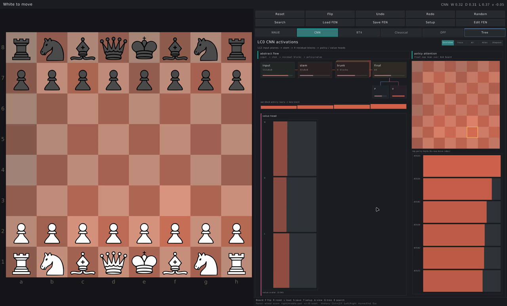
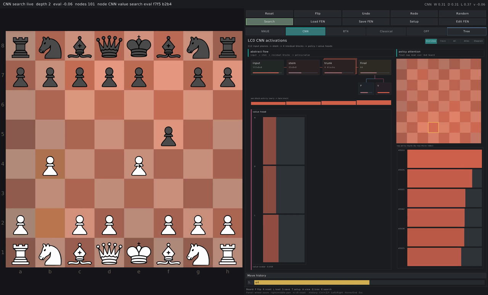
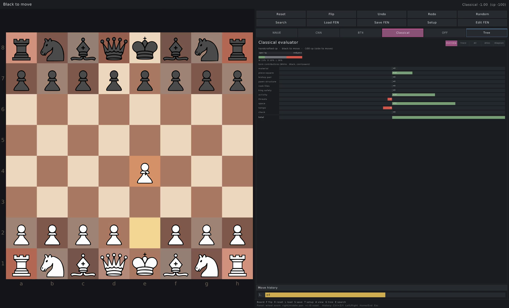
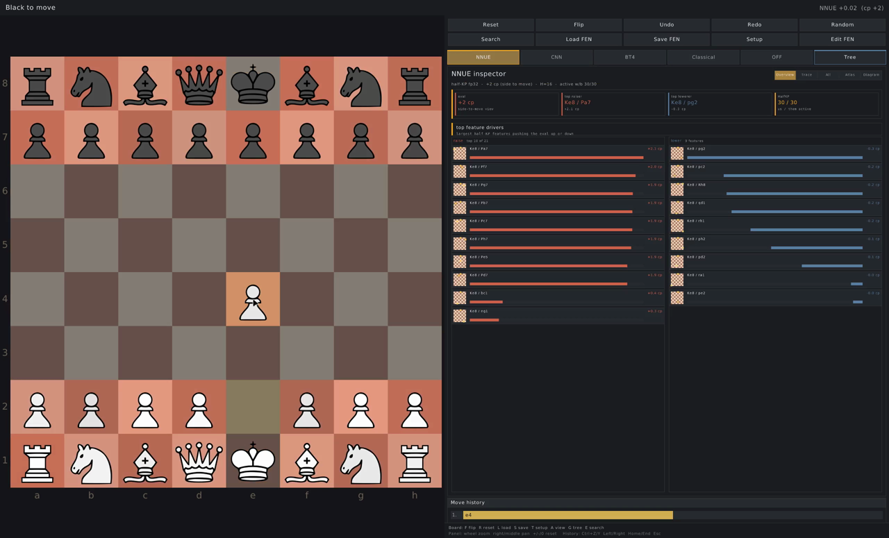
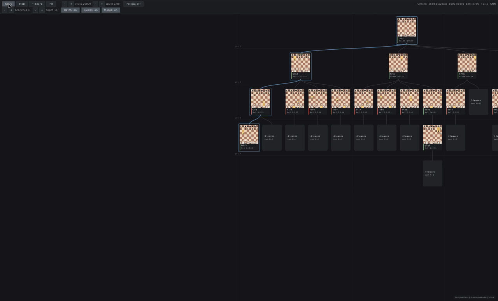

# Test Cases

## 1. Latest Automated Result

Run date: 2026-06-08

Commands:

```sh
./scripts/test.sh
./build/tests/cnnv_tests
```

Result:

```text
ctest: 1/1 passed, 0 failed
cnnv_tests: 151 passed, 0 failed (151 total)
```

The CTest target builds the project and runs the headless `cnnv_tests` binary.
The direct `cnnv_tests` run is used to record the full individual-test count.

## 2. Automated Coverage

| Area | Test files | What is covered |
| --- | --- | --- |
| Bitboards and attacks | `BitboardTest.cpp`, `SlidingAttacksTest.cpp` | square indices, masks, popcount/lsb, bishop/rook/knight/king/pawn attacks. |
| Pieces, moves, move lists | `PieceTest.cpp`, `MoveTest.cpp`, `MoveListTest.cpp` | FEN chars, piece values, packed move encoding, UCI parsing, fixed move-list behavior. |
| Position rules | `PositionTest.cpp`, `PerftTest.cpp`, `SmokeTest.cpp` | start position, make/unmake, castling, en-passant, promotion, check, draw helpers, known perft positions. |
| Notation and file I/O | `FenTest.cpp`, `FenIoTest.cpp`, `SanTest.cpp`, `ConfigIoTest.cpp` | FEN parse/format, FEN files, SAN conversion, config parsing and saving. |
| Game workflow | `GameLoopTest.cpp`, `MoveHistoryTest.cpp`, `EditorValidationTest.cpp` | legal move application, undo/redo linked list, PGN export, setup validation. |
| Tensor operations | `TensorOpsTest.cpp` | tensor allocation, matmul, convolution, activations, softmax, layer norm, batch norm, attention, snapshots. |
| NNUE | `NnueTest.cpp`, `NnueReferenceTest.cpp` | HalfKP feature encoding, loader validation, accumulator behavior, snapshot keys, CRTK reference values. |
| LC0 CNN | `Lc0CnnTest.cpp`, `PolicyEncoderTest.cpp` | 112-plane encoder, LC0J loader, generated runtime model, policy move mapping, WDL/value output. |
| LC0 BT4 | `Bt4Test.cpp` | BT4V metadata, synthetic fallback, BT4J loader guards, generated runtime BT4J model, attention/WDL snapshots. |
| Classical evaluator | `ClassicalTest.cpp` | term symmetry, material, WDL normalization, insufficient material, PST tables, occupied-square heatmap. |
| MCTS | `MctsTest.cpp` | PUCT growth, best move/PV extraction, mate-in-one, snapshot cap, frontier filtering, Q perspective/signatures. |

## 3. Readiness Check

Command:

```sh
./scripts/demo_check.sh
```

Expected result:

- required project PDF exists,
- tutorial GIF and MP4 exist,
- screenshot evidence exists under `docs/screenshots/`,
- Markdown documents have PDF exports under `docs/pdf/`,
- runtime NNUE/CNN/BT4 model files exist,
- key startup config values are checked,
- media metadata is reported when `ffprobe` is installed,
- `./scripts/test.sh` passes.

If a model file is missing, run `./scripts/import_models.sh` and retry.

## 4. Manual UI Smoke Tests

These tests are intended for the live raylib window. They should be repeated
after layout, input, rendering, or model-view changes.

### 4.1 Launch And Board Play

| Step | Action | Expected result |
| --- | --- | --- |
| 1 | Start the app with `./scripts/run.sh`. | Window opens at the configured size, start position is visible, and CNN is selected by default. |
| 2 | Play `1. e4 d5 2. exd5 Qxd5 3. Nc3`. | Moves are legal, pieces animate through click/drag input, status and SAN move list update. |
| 3 | Press `Ctrl+Z` twice, then `Ctrl+Y`. | Board rewinds and replays through the linked-list history. |
| 4 | Click Flip or press `F`. | Orientation changes without changing the FEN. |
| 5 | Click Random. | One legal random move is made if the game is ongoing. |
| 6 | Press `Esc` after selecting a piece. | Selection and legal-target highlights clear. |

### 4.2 FEN Workflow

Kiwipete FEN:

```text
r3k2r/p1ppqpb1/bn2pnp1/2pPN3/1p2P3/2N2Q1p/PPPBBPPP/R3K2R w KQkq - 0 1
```

| Step | Action | Expected result |
| --- | --- | --- |
| 1 | Click Load FEN or press `L`. | FEN dialog opens. |
| 2 | Paste Kiwipete and press Enter. | Position loads and is White to move. |
| 3 | Click Save FEN or press `S`. | `position.fen` is written with the current position. |
| 4 | Open Load FEN and type invalid text. | Dialog stays open and displays an error. |
| 5 | Click Edit FEN from a legal position. | Current FEN opens for editing and then enters setup mode when applied. |

### 4.3 Setup Editor

| Step | Action | Expected result |
| --- | --- | --- |
| 1 | Click Setup or press `T`. | Editor palette and validation panel appear. |
| 2 | Click Clear and Validate. | Validation reports missing kings; Apply is disabled. |
| 3 | Place White king e1, White queen d1, Black king h8; set White to move; Validate. | Validation reports legal; Apply is enabled. |
| 4 | Click Apply. | App returns to board mode with the edited position. |
| 5 | Re-enter Setup and place a second White king. | Validation rejects the position. |
| 6 | Press `Esc`. | Editor exits without committing further changes. |

### 4.4 Activation Views

| Step | Action | Expected result |
| --- | --- | --- |
| 1 | Select NNUE. | NNUE panel shows active features, accumulators, clipped values, output contribution, and centipawn value. |
| 2 | Use the NNUE internal mode selector. | Overview, Trace, All, Atlas, and Diagram modes render without overlapping the panel. |
| 3 | Select CNN. | CNN panel loads the compact LC0J model and shows input/trunk/policy/value information. |
| 4 | Select BT4. | BT4 lazily loads the compact BT4J model and shows token/attention/policy/WDL data. |
| 5 | In BT4 Trace/Atlas, inspect the attention board. | Board squares include pieces from the current position. |
| 6 | Select Classical. | Term breakdown, WDL, phase, and piece-square heatmaps render. |
| 7 | Select Off. | Activation panel hides and chess play still works. |
| 8 | Mouse-wheel over an activation panel, right-drag, then press `0`. | Panel zooms, pans, and resets its camera. |

### 4.5 Search Preview

| Step | Action | Expected result |
| --- | --- | --- |
| 1 | Select CNN and click Search or press `E`. | Search starts, Search button switches to its active color, and depth/nodes/evaluation/PV update. |
| 2 | Press `Esc` or click Search again. | Search stops and the button returns to inactive color. |
| 3 | Start Search, then make or load a different move/position. | Search is stopped before stale output is applied. |
| 4 | Repeat with NNUE, BT4, Classical, and Off. | Each architecture uses its documented evaluation/fallback path without crashing. |

### 4.6 MCTS Tree Workbench

| Step | Action | Expected result |
| --- | --- | --- |
| 1 | Press `G` or click Tree. | Full-window tree screen opens. |
| 2 | Click Start. | PUCT search starts and mini-board nodes grow live. |
| 3 | Use Fit, wheel zoom, and left-drag. | Tree can be framed, zoomed, and panned. |
| 4 | Change visits, cpuct, branches, depth, Batch, Guides, and Merge. | Tree redraws with the selected controls. |
| 5 | Click a node. | Selected node FEN is shown and traced into activation views after returning. |
| 6 | Toggle Follow while search runs. | Current explored leaf is traced into activation views. |
| 7 | Use Space, Left, Right, Home, and End. | Growth-frame scrubber plays and steps through recorded snapshots. |
| 8 | Press `Esc` or `G`. | Tree closes and the main board returns. |

## 5. Tutorial Media

The recorded tutorial files are:

- [`docs/tutorial.gif`](tutorial.gif)
- [`docs/demo.mp4`](demo.mp4)

They demonstrate board play, undo/redo, FEN load/save, setup editing,
architecture switching, and search/tree workflows. If the UI changes
substantially, regenerate the media before final submission.

## 6. Screenshot Evidence

The following still images are extracted from the final screen recording and
are included so the test-case report has direct visual evidence for the main
game workflows.

| Screenshot | Demonstrated workflow |
| --- | --- |
|  | Startup board, local CNN model panel, policy/value visualizations, and default window layout. |
|  | Legal moves, move history, active Search button state, and live search preview output. |
|  | Handcrafted evaluator term breakdown and Classical visualization mode. |
|  | NNUE feature/accumulator view and board overlay. |
|  | Full-window PUCT tree workbench with mini-board nodes and controls. |
